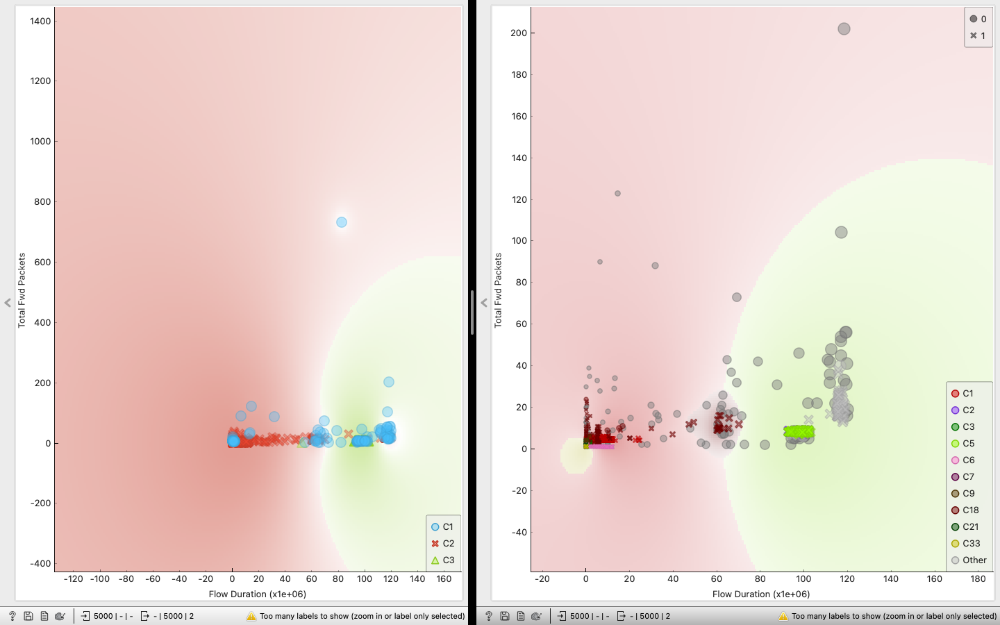

### Extension of LCCDE

by Kyle Berryman, Carson Rivera, Olivia Martinez, Philip Ervin and Samuel Manzanares

Texas State University CS4371.251 Group 2

Original Paper:

L. Yang, A. Shami, G. Stevens, and S. DeRusett, “LCCDE: A Decision-Based Ensemble Framework for Intrusion Detection in The Internet of Vehicles," in 2022 IEEE Global Communications Conference (GLOBECOM), 2022, pp. 1-6.

#### To Run

Requires dependencies in the lccde_extension.ipynb file and the CICID2017 sample dataset provided in the data folder. 

#### Our Contributions

We attempted to improve overall performance by preprocessing the dataset using the density based clustering method DBSCAN instead of the K means method that the authors originally deployed.

Below is a screenshot of our planning process, we partitioned the provided data into 13 different .csv files and ran them through a KMeans algorithm and DBSCAN individually. As we can see on the right DBSCAN is better suited for locating irregularly shaped clusters especially in a large Dataset, it also aided us in locating outliers within the provided Dataset.

This allowed us to build upon the idea that to increase F1 scores and overall performance of the ensemble method throughout, especially in commercial Datasets that can be very large, we need to find irregular data points within the Dataset that can ultimately be percieved as a network attack, which DBSCAN is signifigantly better at than K means.

We also attempted to replace the CatBoost model in the ensemble because it was the lowest performing for every type of attack.

#### Results

We were unable to increase the returned F1 score of the ensemble method using different models. However, the Light GBM using DBSCAN as a preprocessing method instead of K-Means outperformed the original model for our example dataset. This could potentially be extended for the larger dataset used in the original paper. It should be taken into consideration that we used a sample dataset of the CICID2017 with much less class imbalance than the datset used in the original paper.

#### Refrences

Prior Research
- 

Contemporary 
- “Intrusion detection system for cyberattacks in the internet of vehicles environment” by Korium et al., references “LCCDE: A Decision-Based Ensemble Framework for Intrusion Detection in The Internet of Vehicles” by Yang et al., by citing the development and outcomes of the Leader Class and Confidence Decision Ensemble (LCCDE) framework. Specifically, it acknowledges Yang et al.’s use of advanced machine learning algorithms like XGBoost, LightGBM, and CatBoost to improve intrusion detection systems (IDS) in the Internet of Vehicles (IoV). Korium et al. builds upon these concepts by integrating the LCCDE model into their own proposed framework. One key difference Korium et al points out about Yang et al.’s work is that they did not show the learning curves of the models which is crucial to prevent overfitting. Korium et al added hyperparameter optimization to better control model training and mitigate overfitting.They used the LCCDE framework as a reference point or a baseline to demonstrate its advances and differences in approach, aiming to optimize the algorithms and providing additional datasets.
